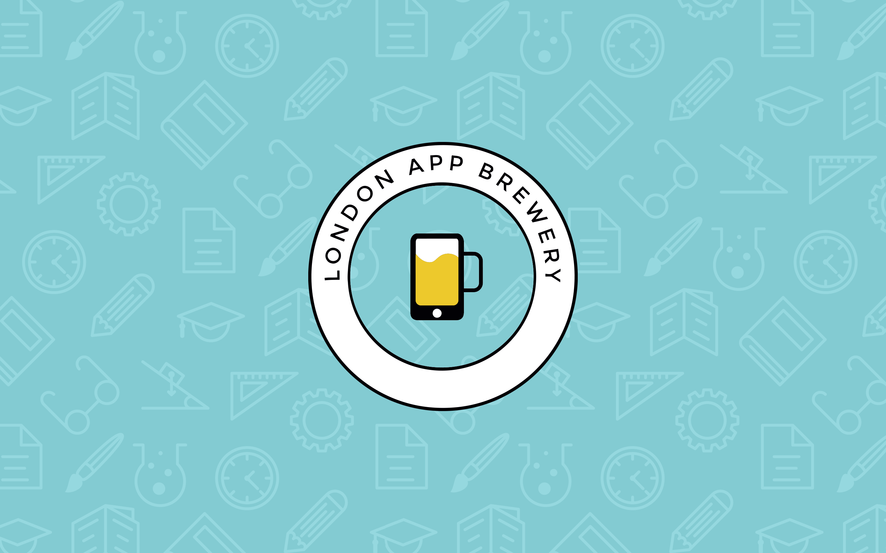

# 100 Days of Code Challenge - Python

This repository contains my progress and projects for the "100 Days of Code" challenge based on a [100 Days of Code: The Complete Python Pro Bootcamp for 2023](https://www.udemy.com/course/100-days-of-code/) course.

## Overview

Master Python by building 100 projects in 100 days. Learn data science, automation, build websites, games and apps!

## Goals

- Learn Python for a minimum of 1 hour every day.
- Work on meaningful projects and exercises.
- Document progress and learning daily.

## 👨🏻‍🎓 Beginner

- [Day 1](Day-01): Working with Variables in Python to Manage Data
- [Day 2](Day-02): Understanding Data Types and How to Manipulate Strings
- [Day 3](Day-03): Control Flow and Logical Operators
- [Day 4](Day-04): Randomisation and Python Lists
- [Day 5](Day-05): Python Loops

<!-- - [Day 6](Day-06): Python Functions & Karel
- [Day 7](Day-07): Hangman
- [Day 8](Day-08): Function Parameters & Caesar Cipher
- [Day 9](Day-09): Dictionaries, Nesting and the Secret Auction
- [Day 10](Day-10): Function Return Values and the Calculator Project
- [Day 11](Day-11): Blackjack Capstone Project
- [Day 12](Day-12): Scope and Namespacing in Python
- [Day 13](Day-13): Debugging: How to Find and Fix Errors in your Code
- [Day 14](Day-14): Higher Lower Game Project -->

---

@aswanijehangeer 🐍 2023
